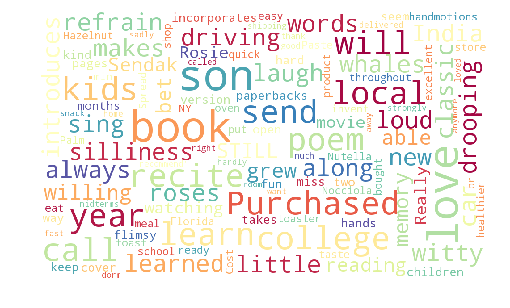

# Amazon-fine-food-reviews

<h3>Dataset: </h3>
<ul> 

<li> Number of reviews: 568,454 </li>
<li> Number of users: 256,059 </li>
<li> Number of products: 74,258 </li>
<li>Number of products: 74,258 </li>
<li>Timespan: Oct 1999 - Oct 2012 </li>
<li>Number of Attributes/Columns in data: 10</li>

</ul>
<h3> 1. Exploratory data analysis on Amazon fine food reviews dataset.</h3>

&nbsp &nbsp &nbsp &nbsp Perform exploratory data analysis on whole data to get some meaningful insights about data.

### Generated Wordcloud on reviews

  

<h3> 2. Perform text sentimental analysis on Amazon fine food reviews</h3>
<ul>
<li>There are large number of reviews in the dataset working with such large reviews can run out of memory and system crashes. So we take a sample of 1,00,000 reviews.</li>
<li>Considering only reviews column for text analysis.</li>
</ul>
<h3>Featurization</h3>
<ul>
<li> Bag Of Words </li>
<li> tfidf vectorization </li>
</ul>

After featurizing text data with Bag Of  Words (BOW)data we got  

<ol> 
  <li>Train size : 64000 with 28885 Dimensions</li>
  <li>CV size : 16000 with 28885 Dimensions</li>
  <li>Test size : 20000 with 28885 Dimensions</li>
</ol>

After featurizing text data with Tf-Idf data we got  

<ol> 
  <li>Train size : 64000 with 28885 Dimensions</li>
  <li>CV size : 16000 with 28885 Dimensions</li>
  <li>Test size : 20000 with 28885 Dimensions</li>
</ol>

Y label is sentiment of the review 
0 for Negative review.  
1 for Positive review.

<h3>Machine Learning Model</h3>
<ul> 
<li> Naive bayes Model </li>
<li> Logistic Regression </li>
</ul>

<h3>Preformance of model with F1 score</h3>
<ul>  Naive bayes Model 
<li> Bag Of Words => 90.94 </li>
<li> Tfidf => 90.61
</ul>
<ul>  Logistic Regression 
<li> Bag Of Words => 93.41 </li>
<li> Tfidf => 91.90
</ul>

## Conclusion

Given data is highly imbalance data with 84% positive and 16% negative score. Taking accuracy as a metric to measure perfomance of the model is a wrong idea because even a dumb model can have an accuracy of 84%. So we take f1 score, precision score and recall score. And also plot connfusion matrix to clearly understand about performance of model.
<ol>
<li>From all above models we can clearly understand that Logistic regression with Bag of words performs better with f1-score 93%.</li>
<li>If we observe the feature importance (positive and negative words) they are more reasonable and good.</li>
<li>From the confusion matrix we can conclude that more positive lables are mis classified as negative, So False Negative value is high compared to False Positive.</li>
  </ol>
